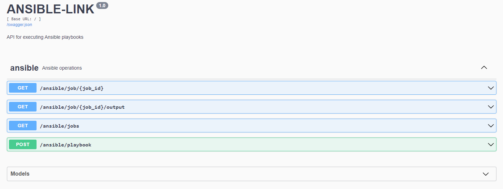

<div align="center" style="display: flex; align-items: center;">
  
  <div>
    <h1>ANSIBLE LINK</h1>
    <p>
      RESTful API for executing Ansible playbooks remotely
    </p>
  </div>
</div>

<p align="center">
  
  
  
  
</p>

## Features
- **Playbook Execution** Asynchronous playbook executions with real-time status updates.
- **Playbook History** Keep track of playbook executions and their status.
- **API Documentation** Swagger UI documentation for easy exploration of the API endpoints.

<b>NOTE</b> Project is usable but still in early development

## Motivation
Searched for a way to run our playbooks automated without the need of AWX or other big projects while still being more stable and less error-prone than custom bash scripts. So I made Ansible-Link. This projects aims to be a KISS way to run ansible jobs remotely. Essentially a RESTful API sitting on top of [ansible-runner](https://github.com/ansible/ansible-runner)

## Prerequisites
* Python 3.7+
* PIP
* Your Ansible node

## Installation
* Clone the repository (on your ansible-node):
```shell
git clone git@github.com:lfkdev/ansible-link.git
cd ansible-link
```

* Install the dependencies:
```shell
# use virtual env
pip install -r requirements.txt
```

* Set config values in `config.yml`
```yaml
playbook_dir: '/etc/ansible/'
inventory_file: '/etc/ansible/environments/hosts'
```

* Start Ansible-Link
```shell
python3 ansible_link/ansible_link.py
```
The API will be accessible at localhost:port (default 5001) or wherever you bind it to.

## API Documentation
The API documentation is available via the Swagger UI.



## Configuration
The API configuration is stored in the `config.yml` file. 
If you move your config to a different location you can use `ANSIBLE_API_CONFIG` 
```shell
$ export ANSIBLE_API_CONFIG='/etc/ansible-link/config.yml'
```

You can customize the following settings:

```yaml
# flask
host: '127.0.0.1'
port: 5001
debug: false

# ansible-runner
suppress_ansible_output: false
omit_event_data: false
only_failed_event_data: false

# general
playbook_dir: '/etc/ansible/'
inventory_file: '/etc/ansible/environments/hosts'
job_storage_dir: '/var/lib/ansible-link/job-storage'
log_level: 'INFO'

# ansible-link (leave blank to allow all)
playbook_whitelist: []
# playbook_whitelist:
#   - monitoring.yml
#   - mariadb.yml
```

The whitelist supports <b>full regex</b>, you could go wild:
```yaml
playbook_whitelist:
  # Allow all playbooks in the 'test' directory
  - ^test/.*\.ya?ml$

  # Allow playbooks starting with 'prod_' or 'dev_'
  - ^(prod|dev)_.*\.ya?ml$

  # Allow specific playbooks
  - ^(backup|restore|maintenance)\.ya?ml$
```
Leave empty to allow all playbooks. This is for the backend, you could also use the `limit` arg from ansible-runner in the request directly.

## Prod environment

**Use WSGI for prod ENV (gunicorn) + systemd service**

### unitd example file
```
[Unit]
Description=Ansible Link
After=network.target

[Service]
User=ansible
Group=ansible
WorkingDirectory=/opt/ansible-link
ExecStart=/usr/local/bin/gunicorn -w 1 -k gthread -b localhost:5000 wsgi:app
Restart=on-failure

[Install]
WantedBy=multi-user.target
```

### Example setup:
```
├── etc/
│   └── ansible/
│       ├── playbooks/
│       │   └── some_playbooks.yml
│       └── inventory/
│           ├── production
│           └── staging
│
├── opt/
│   └── ansible-link/
│       ├── ansible-link.py
│       └── config.yml
│
└── var/
    └── lib/
        └── ansible-link/
            └── job-storage/
                └── playbook_name_20230624_130000_job_id.json
```

### API Endpoints

* <code>POST /ansible/playbook: Execute a playbook</code>
* <code>GET /ansible/jobs: List all jobs</code>
* <code>GET /ansible/job/<job_id>: Get job status</code>
* <code>GET /ansible/job/<job_id>/output: Get job output</code>
* <code>GET /health: Health check endpoint</code>

## Usage

Below are examples demonstrating how to use ansible-link API compared to Ansible CLI.

---
```bash
$ ansible-playbook site.yml
```

```json
{
  "playbook": "site.yml"
}
```

```bash
curl -X POST http://your-ansible-link-server/ansible/playbook \
  -H "Content-Type: application/json" \
  -d '{"playbook": "site.yml"}'
```
---

```bash
$ ansible-playbook deploy.yml -e version=1.5.0 environment=staging
```

```json
{
  "playbook": "deploy.yml",
  "vars": {
    "version": "1.5.0",
    "environment": "staging"
  }
}
```
---

```bash
$ ansible-playbook site.yml --tags "update,packages" -vv
```

```json
{
  "playbook": "site.yml",
  "tags": "update,packages",
  "verbosity": 2
}
```
---

```bash
$ ansible-playbook restore.yml --limit "databases" --forks 3
```

```json
{
  "playbook": "restore.yml",
  "limit": "databases",
  "forks": 3
}
```

---
```bash
$ ansible-playbook site.yml -i custom_inventory.ini -e '{"key1": "value1", "key2": "value2"}' --tags "provision,configure" --skip-tags "cleanup" --limit "webservers:&staged" --forks 10 -vvv
```

```json
{
  "playbook": "site.yml",
  "inventory": "custom_inventory.ini",
  "vars": {
    "key1": "value1",
    "key2": "value2"
  },
  "tags": "provision,configure",
  "skip_tags": "cleanup",
  "limit": "webservers:&staged",
  "forks": 10,
  "verbosity": 3
}
```

--- 

```bash
$ ansible-playbook site.yml -i custom_inventory.ini -e environment=production --diff --check
```

```json
{
  "playbook": "site.yml",
  "inventory": "custom_inventory.ini",
  "vars": {
    "environment": "production"
  },
  "cmdline": "--diff --check"
}
```
Ansible-Link supports the following native parameters:

* playbook: The name of the playbook to run (required)
* inventory: Path to the inventory file
* vars (extravars): A dictionary of additional variables to pass to the playbook
* limit: A host pattern to further constrain the list of hosts
* verbosity: Control the output level of ansible-playbook
* forks: Specify number of parallel processes to use
* tags: Only run plays and tasks tagged with these values
* skip_tags: Only run plays and tasks whose tags do not match these values
* cmdline: Any additional command line options to pass to ansible-playbook

Which means you can always use cmdline if your arg is not natively supported, like:

```json
{
  "playbook": "site.yml",
  "cmdline": "--diff --check -e environment=production -i /etc/ansible/test/custom_inventory.ini"
}
```

### Output
Ansible-Link will save each job as .json with the following info (from ansible-runner):
```json
{
  "status": "successfull",
  "playbook": "<playbook_name>",
  "inventory": null,
  "vars": {
    "customer": "emind"
  },
 "start_time": "2024-06-24T15:32:35.380662",
  "stdout": "<ANSIBLE PLAYBOOK OUTPUT>",
  "stderr": "",
  "stats": {
    "skipped": {
      "<playbook_name>": 8
    },
    "ok": {
      "<playbook_name>": 28
    },
    "dark": {},
    "failures": {
      "<playbook_name>": 1
    },
    "ignored": {},
    "rescued": {},
    "processed": {
      "<playbook_name>": 1
    },
    "changed": {}
  }
}
```
essentially showing everything ansible-playbook would display.

<b>Note</b> After submitting a request to the API, you will receive a job ID. You can use this job ID to check the status and retrieve the output of the playbook run using the /ansible/job/<job_id> and /ansible/job/<job_id>/output endpoints respectively.

## Security Considerations
* Use TLS in production
* Add basic auth
* Remove ProxyFix call if not needed in your setup

## Contributing
Contributions are always welcome - if you find any issues or have suggestions for improvements, please open an issue or submit a pull request.

## License
This project is licensed under the MPL2 License. See the LICENSE file for more information.


